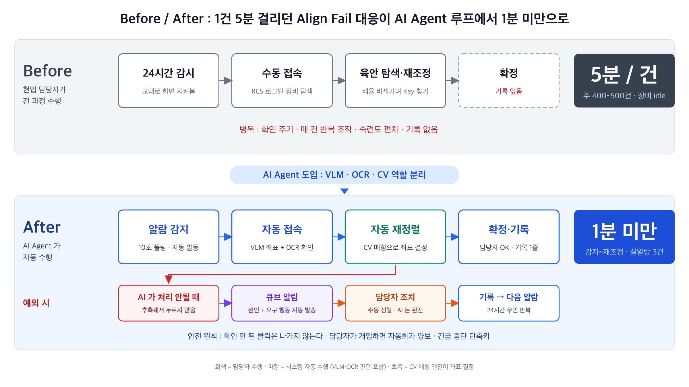
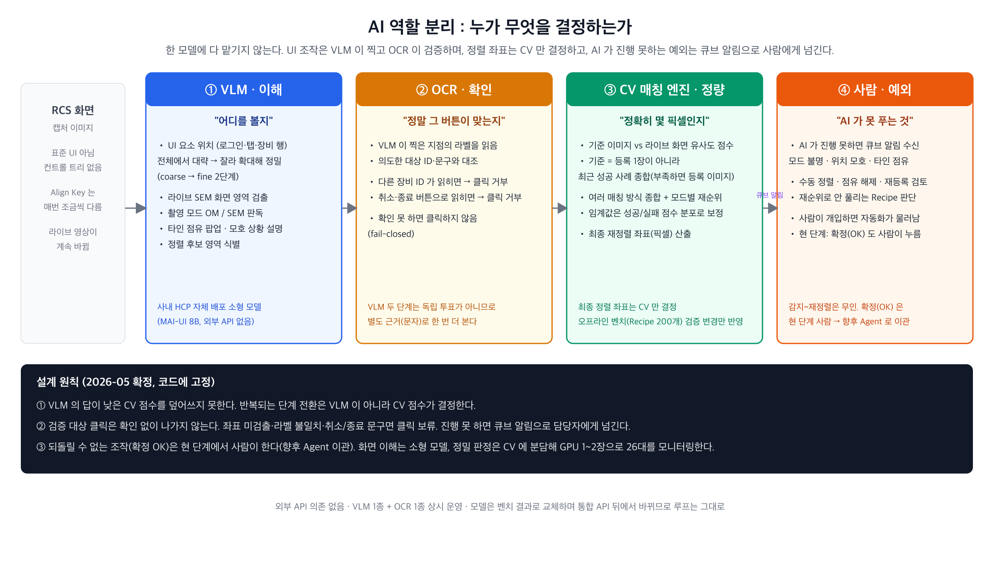
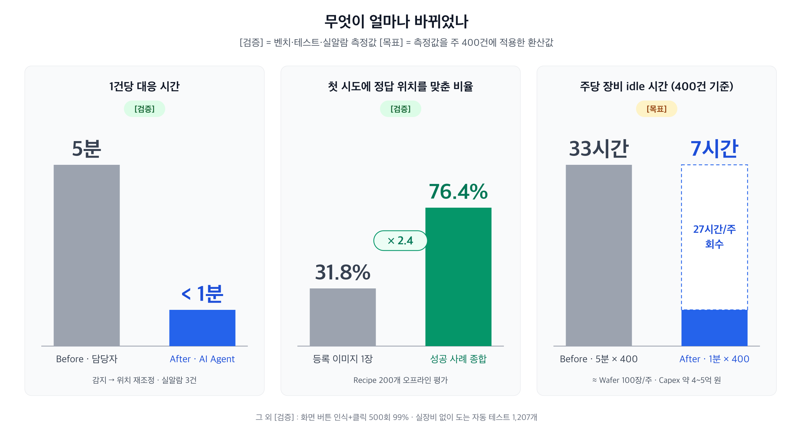

# 2026 AX 업무 혁신 사례 공모전 — 제출 초안 (요약본)

> 사례명(안): **"장비가 멈추면 AI가 먼저 들어간다" — CD-SEM Align Fail 무인 대응 Agent**
> 제출 조직: 기반기술전략&안전 AX Part 최대영 / 현업 협업: R&D DMI NAND MI기술 오정률 / 투입 인원 2명
> 작성 기준일: 2026-09-09 (개발 활동 지표는 2026-09-04 집계) / 상세본: `07_ax_innovation_challenge.md`
>
> 표기 규칙: `[검증]` 은 측정값(오프라인 벤치 / 클릭 시험 / 실알람 실측), `[목표]` 는 측정값을 주 400건에 적용한
> 환산값입니다. 대응 시간의 전후 비교 구간은 **알람 인지~위치 재조정**이며 최종 확정 이후는 제외합니다.
> Align Fail 은 주 400~500건(측정 건수의 약 5%) 발생하며 환산은 하한 400건을 씁니다.

---

## 1. 사례 요약

R3 연구소 팹 CD-SEM 26대의 Wafer In-line 측정 시 Align Fail(정렬 실패)이 **주 400~500건** 발생합니다. 현업 담당자가 RCS(Remote Control System, 장비 원격 제어 프로그램) 모니터를 24시간 감시하다 멈춘 장비에 접속해 **1건 5분**씩 고치던 일을 **AI Agent가 감지·접속·재정렬·기록까지 무인으로 수행**하도록 바꾼 사례입니다. 감지에서 위치 재조정까지 걸리는 시간은 **1분 미만**으로 줄었습니다.

**문제.** 계측 장비는 Recipe(측정 설정)에 등록된 기준 이미지(Align Key)를 Wafer 화면에서 찾아 좌표를 맞추는데, 공정 변동으로 등록 이미지와 실제 화면이 달라지면 정렬에 실패하고 **그 자리에서 멈춥니다**. 현업 담당자가 24시간 교대로 모니터를 감시하다 접속해 Align Key를 배율을 바꿔가며 육안으로 찾아 재조정했고, 1건당 5분은 전부 장비 idle이었습니다(주 400건이면 **약 33시간**). 실패 화면도 남지 않았습니다. 계측 화면이 표준 UI가 아니라 **일반 RPA 도구가 버튼을 인식하지 못하고**, Align Key는 매번 조금씩 달라 **고정 좌표·템플릿으로 풀리지 않는** 규칙 기반 자동화의 사각지대였습니다.

{: .fig-l }

**해결.** AI에 다 맡기지 않고 역할을 나눴습니다. **VLM(Vision Language Model, 화면을 이해하는 모델)은 "어디를 볼지"**, **OCR(문자 인식)은 "정말 그 버튼인지"**, **CV(Computer Vision) 매칭 엔진은 "정확히 몇 픽셀인지"**를 맡고 뒤 단계가 앞 단계를 검증합니다. 확인이 안 되면 클릭하지 않고 담당자에게 원인과 요구 행동을 알립니다. 현업 담당자는 예외 판단과 최종 확정(OK)만 맡습니다. 화면 이해는 사내 HCP(모델 운영 플랫폼)에 자체 배포한 소형 모델이, 정밀 판정은 CV가 맡아 외부 API 없이 GPU 1~2장으로 26대를 모니터링합니다. **알람 감지 → RCS 자동 접속 → 상시 녹화 → 화면 판독 → 성공 사례 기반 자동 재정렬 → 확정 → 자동 종료 → 기록 1줄**이 한 루프로 돕니다. 정확도는 오프라인 벤치(Recipe 200개)에서 A/B로 확보했습니다.

**성과.** 건당 대응 시간이 5분에서 **1분 미만**으로 줄었습니다(실알람 3건 실측 `[검증]`). 주 400건이면 **약 27시간/주**의 장비 시간이 돌아와 **Wafer 약 100장/주**를 더 측정할 수 있고, **장비 약 0.2대 = Capex 약 4~5억 원**에 해당합니다 `[목표]`. 담당자는 예외 판단만 맡고, 대응 1건마다 화면 증거와 기록 1줄이 남습니다. 2026-08 실장비 보정 개통, 2026-09 실알람 3건 완주와 현업 합동 시험을 거쳐 R3 26대 실전 배치를 준비 중입니다.

---

## 2. 사례 상세

### 2.1 업무 문제와 기존 방식의 한계

**대상 업무.** R3 CD-SEM 26대의 Align Fail(Smart Alarm 9006) 대응입니다. 정렬이 실패하면 장비는 진행을 멈추고 현업 담당자가 조치할 때까지 홀드됩니다. R3는 연구소 팹이라 Lot Split과 공정 Variation이 많아 등록 이미지와 실제 Wafer 이미지가 달라지는 일이 구조적으로 되풀이됩니다.

**현업 필요성.** 장비 홀드는 뒤에 선 Lot 전체를 기다리게 해 계측 WIP과 연구소 팹의 개발 속도를 지연시킵니다. Fab 인라인 구성원과 MI 엔지니어가 RCS 모니터를 24시간 교대로 감시하는 데 묶여 있고, 화면을 보고 판단하는 단계가 있어 숙련자의 시간이 반복 작업에 들어갑니다. 실패 시점 화면이 남지 않아 어떤 Recipe의 Align Key를 재등록해야 하는지 근거로 판단하기 어려웠습니다.

**기존 방식의 비효율.** 감지는 현업 담당자의 감시 주기에 의존해 야간·교대 인계 구간에 지연되고, 접속은 매 건 같은 조작을 반복하지만 비표준 UI라 기존 자동화 도구가 붙지 않습니다. Align Key 육안 탐색과 재조정 정밀도는 숙련도에 좌우되며 반복 패턴이 많은 고배율 화면은 현업 담당자도 오판합니다. 기록이 없어 개선 우선순위를 감으로 정했습니다.

### 2.2 AI 적용 과정과 구현한 기능

2026년 2월 화면 이해 AI 확보에서 시작해 네 단계로 진행했습니다.

**① 화면 이해 AI 확보(02~03월, 운영 구성 확정 08월).** 외부 API에 기대지 않고 Hugging Face 오픈웨이트 VLM 3종(MAI-UI, UI-Venus, UI-TARS)과 OCR 2종(PaddleOCR-VL, GOT-OCR)을 사내 HCP에 설치하고 통합 API 한 곳으로 라우팅해 벤치 결과로 바꿔 끼울 수 있게 했습니다. 장비 제조사가 소수 엔지니어용으로 만든 화면은 버튼이 오밀조밀해 현업 담당자도 조작이 어려운데, 실제 업무 화면 비교에서 소형 모델 MAI-UI가 가장 높은 성공률을 보였습니다(좌표 인식+클릭 500회 99% `[검증]`). VLM 1종 + OCR 1종 상시 운영으로 정리했습니다.

**② 장비 원격 제어(RCS) 자동화(03~05월).** 단일 모델이 한 번에 좌표를 찍는 방식은 확률적으로 실패했습니다. 전체 화면에서 대략 영역을 찾고(coarse), 잘라 확대해 정밀 클릭점을 정하고(fine), 클릭 전 그 자리의 라벨을 OCR로 읽어 확인(confirm)하는 3단계로 바꿨습니다. RCS 실행·로그인·탭 이동·장비 선택·화면 캡처·창 닫기를 이 방식으로 자동화해 오피스 실장비에서 안정적으로 수행함을 확인했습니다.

**③ 정렬 정확도 확보: 오프라인 A/B 벤치(05~07월).** Recipe 200개의 등록 이미지와 과거 실패 이미지로 실장비를 건드리지 않는 평가 환경을 만들고, 여기서 이긴 방식만 운영에 반영했습니다. 채택한 것은 둘입니다. **성공 사례 종합(consensus) 기준 이미지**는 등록 1장 대신 최근 정렬 성공 이미지 여러 장을 합성한 것으로, 같은 Recipe면 장비가 달라도 공유하며 rank-1을 31.8%에서 76.4%로 올렸습니다. **촬영 모드별 후보 재평가**는 저배율(OM)과 고배율(SEM)에서 이기는 심판이 달라 모드에 따라 전환하는 방식으로 SEM rank-1을 약 7.3%p 더 올렸습니다.

**④ 실시간 통합 루프(06월~).** Align Fail 알람을 사내 data-hub에 적재하고 h-api를 10초 간격으로 조회하는 수신 기반을 만든 뒤 ①~③을 묶어 감지부터 기록까지 무인으로 도는 루프를 구축했고, 08월 실장비 보정을 개통했습니다. 구현한 기능은 다음과 같습니다.

| 기능 | 구현 내용 |
|------|-----------|
| 알람 감지·사전 고지 | 10초 주기로 알람을 조회해 Align Fail만 선별, 신규 발생 시 1회 발동. 담당자에게 "AI 가 대응 시작" 큐브 알림 |
| RCS 자동 접속 | RCS 실행·로그인·장비 목록에서 알람 장비 선택·접속. RCS가 꺼져 있거나 로그아웃 상태면 재실행·재로그인 |
| 화면 판독 | 라이브 SEM 영역 검출, 촬영 모드(OM/SEM) 판독, 타인 점유 여부 판별 |
| 자동 재정렬 | 모드에 맞는 기준 이미지(성공 사례 종합, 부족하면 등록 이미지)로 CV 매칭 → 재정렬 좌표 산출 → 화면 재조정. 첫 화면에서 못 찾으면 배율을 낮춰 주변을 격자 탐색 |
| 확정·완료 감시·종료 | 재조정 결과 확정(현 단계 담당자 OK, 향후 Agent) → 측정 재개 감시 → tool 창 자동 종료 |
| 예외 알림 | 보정 불가·모드 불명·위치 모호·타인 점유면 원인·요구 행동·매칭 점수를 담아 큐브 알림. 설정 문제와 Recipe 재등록 검토를 구분해 안내 |
| 기록 | 접속 즉시 상시 녹화, 실패 시점 화면 증거, 대응 1건 = 기록 1줄(시도 횟수·판정 근거·결과). 재등록 검토 후보 Recipe 목록 산출 |

### 2.3 난이도와 극복

| 난이도 | 극복 방식 |
|--------|-----------|
| 계측 화면이 표준 UI가 아니라 기존 자동화 도구가 버튼을 인식하지 못함 | 화면 이미지로 위치를 찾는 VLM + OCR 확인. 클릭 성공률 99% |
| Align Key가 공정 변동으로 매번 달라 고정 템플릿으로 풀리지 않음 | 여러 매칭 방식 종합 + 기준 이미지를 최근 성공 사례 종합으로 교체 |
| 고배율 SEM 화면은 반복 패턴이라 가짜 후보가 많음 | 촬영 모드별로 기준 이미지·평가 방식을 분리. 남는 실패는 Align Key 재등록 과제로 현업과 검토 |
| 실장비 클릭은 오동작 시 측정에 영향 | 확인 안 되면 클릭하지 않고 담당자에게 알림. 점검 모드 → 반자동 → 합동 시험 → 배치의 단계적 게이트 |

### 2.4 소요 기간·조직 영향·확산 가능성

**소요 기간.** 2026년 2월부터 **약 7.5개월**, 투입 **2명**. 검증을 통과한 기능부터 루프에 반영하고 벤치·자동 테스트로 실장비 없이 반복했습니다.

**조직 영향.** 24시간 감시·접속·육안 탐색의 부담이 "예외 판단"으로 옮겨 가고, 실패 화면·기록 1줄·재등록 권고 목록이라는 데이터 기반이 새로 생깁니다. 이번 개발로 얻은 이미지 기반 화면 자동화·VLM 사내 배포·CV 벤치 노하우는 다른 장비의 **Auto Recipe Creation(ARC)** 에 공유합니다.

**확산.** 지금의 **Align Tuning Agent**(이 사례) → 2027 **Recipe Tuning 자동화** → 장기 **Auto Recipe Creation** 으로 이어집니다.

### 2.5 Before / After 요약

| 항목 | Before | After |
|------|--------|-------|
| 1건당 대응 시간(감지 → 위치 재조정) | 5분 | **1분 미만** `[검증]` |
| 주당 장비 idle(400건) | 약 33시간 | **약 6.7시간** (약 27시간 회수) `[목표]` |
| 추가 측정량 · 장비 환산 | - | **Wafer 약 100장/주** · **장비 약 0.2대 = Capex 약 4~5억 원** `[목표]` |
| 24시간 대응 체계 | 인라인·엔지니어가 교대로 모니터 감시·접속·육안 탐색 | 감지·접속·재조정 자동, 담당자는 예외 판단 |
| 실패 기록 | 없음 | 대응 1건 = 기록 1줄 + 화면 증거 + 녹화 |

---

## 3. 정량적 + 정성적 성과

### 3.1 목표 대비 달성 현황

| 목표 | 달성 | 근거 |
|------|------|------|
| 비표준 계측 화면의 GUI 자동화 | ✅ | RCS 로그인~장비 접속~닫기 실장비 자동 수행, 클릭 성공률 99% |
| 화면 이해 AI 사내 자체 배포 | ✅ | 사내 HCP 에 VLM 1종 + OCR 1종 상시 운영 |
| 정렬 위치 찾기 정확도 개선 | ✅ | 첫 시도 정답률 31.8% → 76.4% |
| 감지~보정~기록 무인 루프 | ✅ / 🔄 | 실알람 3건 감지~재조정 1분 미만. 기록은 현장 적재 확인 중 |
| 실전 배치 | 🔄 | 전용 PC 확보, R3 26대 배치 준비 |

### 3.2 정량 성과

| 항목 | Before | After | 근거 |
|------|--------|-------|------|
| 1건당 대응 시간(감지 → 위치 재조정) | 5분 | **1분 미만** | 실알람 3건 `[검증]` |
| 첫 시도에 정답 위치를 맞춘 비율 | 31.8% | **76.4%** (약 2.4배) | Recipe 200개 오프라인 평가 `[검증]` |
| 화면 버튼 인식 + 클릭 성공률 | 자주 빗나감 | **99%** (500회) | `[검증]` |
| 주당 회수 장비 시간 · 환산(400건) | - | **약 27시간** = Wafer 약 100장/주 = 장비 약 0.2대(Capex 약 4~5억 원) | `[목표]` |

**정렬 정확도.** 처음에는 Recipe에 등록된 기준 이미지 1장과 비교해 첫 시도 성공률이 31.8%에 그쳤습니다. **최근 정렬에 성공한 화면 여러 장을 취합해 기준 이미지를 만드는 방식(consensus)** 으로 바꿔 76.4%로 올렸습니다. 오프라인 평가값이며, 현장 자동 복구 성공률은 배치 후 기록으로 따로 집계합니다.

**대응 시간과 환산.** 3건은 표본이 작아 운영 성공률로 일반화하지 않고 배치 후 건별로 계속 기록합니다. 환산은 건당 4분 × 주 400건, Wafer 1장 측정 15분, 장비 1대 약 20억 원 기준이며 배치 후 실측으로 바꿉니다.

### 3.3 정성 성과

| 항목 | Before | After |
|------|--------|-------|
| 24시간 대응 체계 | 교대로 모니터 감시·접속·육안 탐색 | 감지·접속·재조정 자동, 담당자는 예외 판단 |
| 실패 기록 | 없음 | 실패 화면 + 녹화 + 대응 1건 = 기록 1줄 |
| 재등록 필요성 판단 | 경험에 의존 | 헷갈리는 Align Key Recipe 목록 자동 산출(오프라인 평가 기반, 현업 대조 중) |
| 보정 불가 알림 | 상태 코드 한 줄 | 원인·요구 행동을 담아 담당자에게 큐브 알림 |

현업 담당자는 AI가 넘긴 예외만 판단하고, 실패가 기록으로 쌓여 다음 개선 순서를 데이터로 정합니다. AI로도 못 찾는 실패는 대부분 등록된 Align Key 자체가 헷갈리는 경우라 재등록 검토 목록을 자동으로 뽑아 현업이 할 일을 명확히 했습니다.

### 3.4 지속 가능성

정확도 평가와 자동 테스트 1,207개가 실장비 없이 다시 돌아 누구나 재현할 수 있고, 주요 변경마다 이전 구성으로 되돌리는 설정을 두었으며, 대응 1건이 기록 1줄로 쌓여 개선 근거가 계속 생깁니다. 담당자가 바뀌어도 이어받을 수 있습니다.

---

## 4. SKMS 기본 정신 · Operation Improvement 측면 서술

### 4.1 패기 — 일과 싸워서 이기는 힘

> "패기 있는 구성원은 **스스로 동기부여하여 문제를 제기하고, 높은 목표에 도전하며, 기존의 틀을 깨는 과감한 실행**을 한다." (SKMS 전문, VWBE 문화. 사내 공식 판본 대조는 제출 전 확인)

- **오래 현업 담당자가 하던 일을 자동화 과제로 정의했습니다.** 주 400~500건, 건당 5분, 24시간 교대 감시를 수치로 세우고, 자동화 도구가 안 붙는 비표준 화면을 안 되는 이유가 아니라 풀어야 할 문제로 삼아 목표를 감지~기록 무인 루프로 잡았습니다.
- **맞는 AI를 직접 찾고, 안 되는 영역은 다른 기술로 채웠습니다.** 오픈웨이트 모델 5종을 사내 HCP에 설치해 장비 화면으로 비교한 뒤 VLM 1종 + OCR 1종을 골랐고, VLM이 약한 픽셀 정밀도는 CV 매칭 엔진과 성공 사례 취합 기준(consensus)으로 채워 첫 시도 성공률을 2.4배 올렸습니다.
- **장비에 붙여도 되는 수준까지 밀어붙였습니다.** 확인 안 되면 클릭하지 않는 원칙, 실장비 없이 도는 자동 테스트 1,207개, 점검 모드 → 반자동 → 합동 시험 → 배치의 단계적 게이트로 실알람 3건을 완주했습니다. AI로도 못 찾는 실패는 Align Key 재등록이라는 현업 과제로 정의해 못 푸는 몫을 숨기지 않았습니다.

### 4.2 Teamwork — 다른 팀이 같은 팀처럼

> "회사는 **조직화된 힘**을 통해 가용자원을 효과적으로 활용하여 최대한의 가치를 창출하는 공동체이다." (SKMS 전문)

- **기반기술전략 AX Part와 R&D DMI NAND MI기술이 각 1명씩 같은 팀처럼 일했습니다.** AX 쪽이 기능을 고치면 현업이 곧바로 장비에서 시험하고 다시 고치는 사이클이 7.5개월 내내 돌았습니다.
- **현업 엔지니어가 시험 환경과 판단 규칙을 만들어 줬습니다.** 시험용 Wafer와 Recipe로 Align Fail 재현 환경을 구축해 실알람을 기다리지 않고 기능을 확인했고, 저배율·고배율에서 Align Key가 다르게 보인다는 장비 지식은 촬영 모드별 판정 방식에, 실패 중에도 측정 카운터가 올라간다는 현장 확인은 완료 판정 기준에 반영됐습니다.

### 4.3 Operation Improvement with AI

**기존 프로세스의 불편함.** 매 건 같은 순서를 반복하는 **수작업**, 같은 실패를 매번 다른 담당자가 처음부터 판단하는 **중복 확인**, 개인 경험에 좌우되는 **숙련도 의존**, 24시간 감시 주기에 묶인 **처리 지연**, 추적할 기록이 없는 **오류 가능성**이 있었습니다.

| AI·자동화 기능 | 적용 지점 | 무엇이 달라지나 |
|----------------|-----------|-----------------|
| **탐지** | 알람을 10초마다 조회해 Align Fail만 발동, 접속 후 화면 상태를 읽음 | 24시간 모니터 감시 자동화 |
| **자동 대응** | RCS 접속 → 녹화 → 성공 사례 기준 재정렬 → 확정 → 종료 | 감지~재조정 5분 → 1분 미만 |
| **이상치 필터·예외 알림** | 확인 안 되면 클릭·보정 보류, 보정 뒤 오측이 보이면 후속 측정 중단, 원인·요구 행동을 담아 담당자에게 큐브 알림 | 불확실한 조작은 하지 않고 담당자는 예외만 판단 |
| **기록·자산화** | 대응 1건 = 기록 1줄, 실패 화면·녹화 보존, 재등록 검토 후보 산출 | 개선 순서를 감이 아니라 데이터로 |

**개선 효과.** 처리 시간 5분 → 1분 미만으로 주 약 27시간의 장비 시간이 돌아오고(`[목표]`), 첫 시도 정답률 31.8% → 76.4%, 화면 조작 성공률 99% 입니다(`[검증]`). 담당자가 경험으로 하던 판단을 규칙으로 **표준화**했고, 재등록 후보를 자동으로 뽑아 **재작업**의 근본 원인을 줄일 기반을 마련했으며, 화면 자동화 패턴과 모델 배포 체계는 다른 장비의 Auto Recipe Creation(ARC)으로 **확산**됩니다. AI가 맡을 몫(반복 조작·1차 판정)과 현업 담당자가 맡을 몫(예외 판단)을 가른 것이 이 사례의 Operation Improvement 입니다.

---

## 제출 전 확인 목록

1. SKMS 인용 문구의 사내 공식 판본 대조(§4).
2. 시연 영상 첨부와 실알람 3건 건별 일자·소요 시간·종료 상태 표 추가(§3.4).
3. 전용 PC 시험 시작 여부에 따라 §1·§2.4·§3.1의 배치 상태 문구 최종 확인.
4. 제목의 "제출 초안"·"사례명(안)" 표기 정리.
